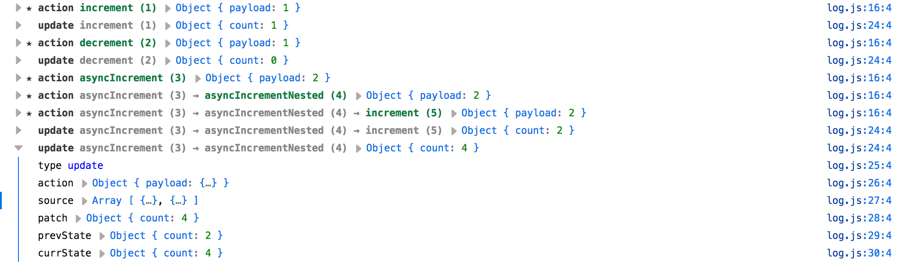

Sometimes it's useful to see a log of all the actions and state updates. **Tiny Atom** ships with a built in console logger.

Enable it like this:

```js
const createAtom = require('tiny-atom')
const log = require('tiny-atom/log')

const atom = createAtom(initialState, actions, { debug: log })
```

Open browser's console to see what actions are firing and what state updates are being applied.


