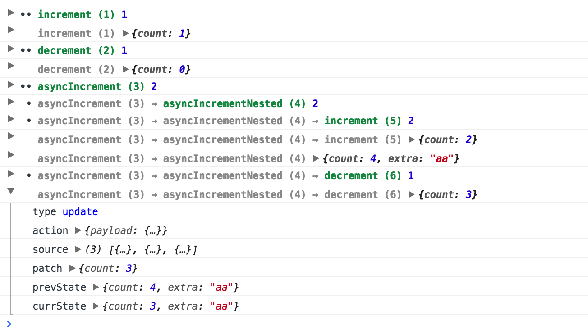

Sometimes it's useful to see a log of all the actions and `atom` state changes. **Tiny Atom** ships with a built in console logger.

Enable it like this:

```js
const createAtom = require('tiny-atom')
const log = require('tiny-atom/log')

const atom = createAtom({}, evolve, render, { debug: log })
```

Now open browser's console in your app and you should see what actions are firing and what state updates are applied.



Legend:

* rows containing <span style='font-weight: bold; color: #05823d'>green</span> action names are actions
* rows containing only <span style='font-weight: bold; color: #888'>gray</span> action names are updates
* two dots `••` indicate a top level action
* one dot `•` indicate a nested action
* the object at the end of the row is the action payload for action rows
* the object at the end of the row is the patch object for update rows
* expanded rows contain more details about each row
