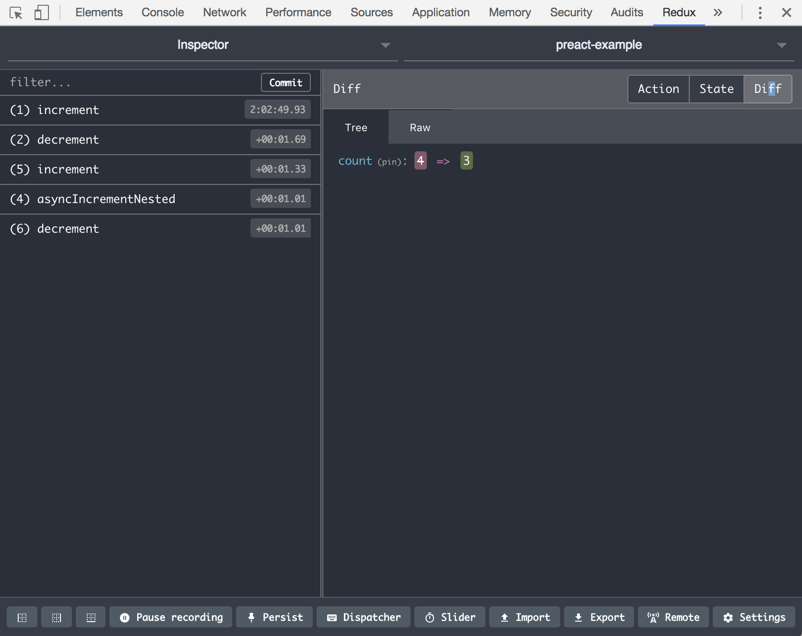

**Tiny Atom** ships with an integration to [Redux DevTools Extension](http://extension.remotedev.io/). Check out their website for instructions on how to install the browser extension.

Once you have the browser extension, using the devtools is as easy as:

```js
import createAtom from 'tiny-atom'
import devtools from 'tiny-atom/devtools'

const atom = createAtom({}, evolve, render, { debug: devtools() })
```



Note: unlike the console logger (`tiny-atom/log`), devtools only lists the state updates and not the actions. In **Tiny Atom** - an action can cause 0 or more state updates. In devtools the action itself is not listed, only the state updates are. In devtools terminology and UI these will appear as actions. You can click on actions in devtools to find out more details about what caused this state update.
